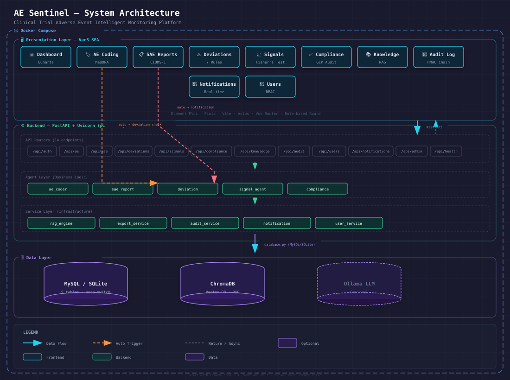

# 🏥 AE Sentinel

**AI-Powered Adverse Event Monitoring Platform for Clinical Trials**

[](https://www.python.org/)
[](https://fastapi.tiangolo.com/)
[](https://vuejs.org/)
[](https://www.docker.com/)
[](LICENSE)
[]()

> 药物临床试验不良事件智能监测平台 — MedDRA 编码 · SAE 报告 · 方案偏离检测 · 安全性信号挖掘 · 合规质控

**AE Sentinel** is a comprehensive clinical trial safety monitoring system. It automates the entire pharmacovigilance workflow: from adverse event (AE) coding and severity assessment to SAE report generation, protocol deviation detection, safety signal mining, and compliance auditing — all backed by an HMAC-verified audit trail.

---

## ✨ Features

| Module | Description | Key Capability |
|--------|-------------|----------------|
| 🏷️ **AE Coding** | Auto MedDRA coding & severity assessment | Keyword-based synonym matching, batch import |
| 📋 **SAE Reports** | CIOMS-I report generation & export | PDF/DOCX/JSON export with fpdf2 rendering |
| ⚠️ **Deviation Detection** | Protocol deviation auto-detection | 7 built-in rules, cross-agent AE→deviation linkage |
| 📊 **Signal Mining** | Safety signal detection | Organ-class aggregation, Fisher's exact test, PubMed search |
| ✅ **Compliance** | GCP compliance quality control | Multi-dimension audit, compliance scoring |
| 📚 **Knowledge Base** | RAG-powered document management | ChromaDB vector storage, semantic search |
| 🔐 **Audit Trail** | Tamper-evident audit logging | HMAC hash chain, integrity verification |
| 🔔 **Notifications** | Real-time alerts | Auto-triggered on deviation/SAE events |
| 👥 **RBAC** | Role-based access control | Admin / PV Specialist / CRA |

---

## 🏗️ Architecture



**Three-layer separation**: API Router → Agent (business logic) → Service (infrastructure)

---

## 🚀 Quick Start

### Prerequisites
- Python 3.9+
- Node.js 18+ (for frontend dev)
- Docker & Docker Compose (for containerized deployment)

### Option 1: Docker (Recommended)
```bash
# Clone and start
git clone https://github.com/mgj10086/AEPD-Sentinel.git
cd AEPD-Sentinel
docker-compose up -d

# Open http://localhost
# Default login: admin / admin123
```

### Option 2: Local Development
```bash
# Backend
pip install -r requirements.txt
python run.py                    # → http://localhost:8000

# Frontend (new terminal)
cd frontend && npm install && npm run dev
# → http://localhost:5173 (auto-proxies /api to backend)

# Run tests
python test_e2e.py
```

---

## 📖 Documentation

| Document | Description |
|----------|-------------|
| [操作手册.md](项目文件/操作手册.md) | User manual (Chinese) |
| [前后端接口文档.md](项目文件/前后端接口文档.md) | API documentation |
| [开发计划书.md](项目文件/开发计划书（完善版）.md) | Development plan |
| [版本更新日志.md](项目文件/版本更新日志.md) | Changelog |
| [项目书.md](项目文件/项目书.md) | Project proposal |

---

## 🛠️ Tech Stack

| Layer | Technology |
|-------|------------|
| **Backend Framework** | FastAPI 0.111+ / Uvicorn |
| **Frontend** | Vue 3 Composition API / Pinia / Element Plus / ECharts / Vite |
| **Database** | MySQL (production) / SQLite (dev) — auto-switch via env |
| **Vector DB** | ChromaDB (persistent, semantic search) |
| **Auth** | JWT (HS256) with role-based access |
| **PDF Export** | fpdf2 (CIOMS-I report with CJK fonts) |
| **Container** | Multi-stage Docker build (Node → Python+Nginx) |

---

## 📁 Project Structure

```
AEPD Sentinel/
├── backend/
│   ├── agents/          # Business logic (AE coder, SAE, deviation, signal, compliance)
│   ├── api/             # 14 REST routers (auth, ae, sae, deviations, signals, ...)
│   ├── services/        # Infrastructure (RAG, export, audit, notification, user)
│   ├── core/            # Config, database abstraction, auth middleware
│   └── main.py          # FastAPI app entry
├── frontend/
│   └── src/
│       ├── views/       # 10 page components (lazy-loaded)
│       ├── router/      # Role-based routing + auth guard
│       ├── stores/      # Pinia store (token/user/loading/error)
│       ├── components/  # AppLayout (sidebar + notification bell)
│       └── api/         # Axios instance + interceptors
├── lib/                 # Vendored deps (PyJWT, PyMySQL, python-multipart)
├── data/
│   ├── chroma/          # Vector DB persistence
│   └── docs/            # Domain reference documents
├── docker-compose.yml   # App + ChromaDB (+ optional Ollama)
├── Dockerfile           # Multi-stage: node build → python+nginx runtime
└── test_e2e.py          # End-to-end tests
```

---

## 🔒 Security

- `.env` and `keys.txt` are **never** committed (gitignored)
- JWT authentication with token expiry
- Audit logs protected by **HMAC hash chain** — tampering is detectable via `/api/audit/verify`
- Role-based UI: menu items filtered by user role
- Vendored dependencies in `lib/` — no supply-chain risk for critical packages

---

## 🧪 Test Accounts

| Role | Username | Password |
|------|----------|----------|
| Admin | admin | admin123 |
| PV Specialist | pv_specialist | pv123 |
| CRA | cra | cra123 |

> ⚠️ These are seed data for development. Change passwords in production.

---

## 🤝 Contributing

See [CONTRIBUTING.md](.github/CONTRIBUTING.md) for guidelines. This project follows the [Contributor Covenant Code of Conduct](CODE_OF_CONDUCT.md).

Areas welcome for contribution:
- LLM integration (Zhipu/Qwen API endpoints are pre-configured)
- MedDRA dictionary upgrade (currently keyword-based)
- Real Fisher's exact test replacing simulation
- Internationalization (i18n)

---

## 📄 License

MIT License — see [LICENSE](LICENSE) for details.

---

## ⭐ Star History

If you find this project useful, please consider giving it a ⭐ — it helps others discover it!

---

*Built with ❤️ using Claude Code — a "Super Individual" project demonstrating that AI-assisted development can produce production-grade clinical software.*
